# 中国近现代史纲要互动复习使用指南

本文档简要介绍项目的核心功能。截图基于当前本地 dev 版本生成。

## 桌面端

### 1. 作答与知识点高亮

在桌面端，左侧是答题区，右侧是复习资料。选择答案后点击“提交答案”，系统会显示判题反馈，并在右侧资料区高亮这道题对应的知识点。

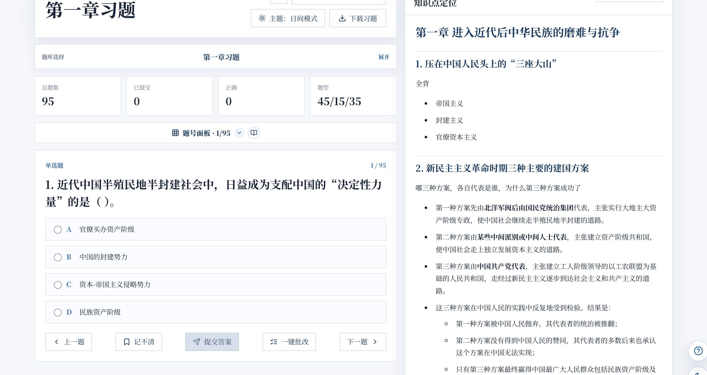

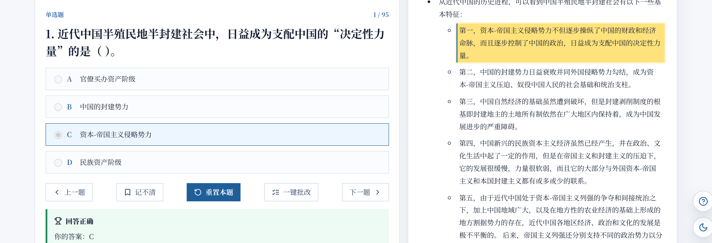

### 2. 判题模式切换

顶部的“判题模式”菜单可以切换不同的判题方式。常用方式包括“提交后判题”和“点选即判”；前者适合按题练习，后者适合快速刷题。

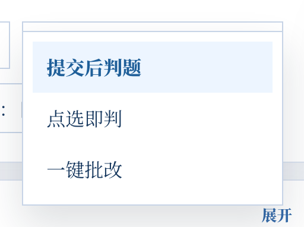

### 3. 重置作答

题目提交后，答题区中间的提交按钮会变为“重置本题”。点击后可清除当前题作答，便于重新练习。

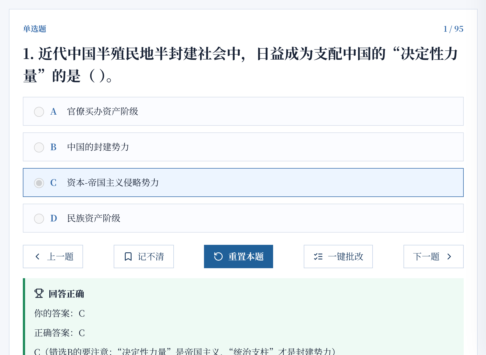

### 4. 帮助与功能说明

右下角问号按钮可以打开帮助面板，查看各按钮含义，也可以重新开始交互式导览。

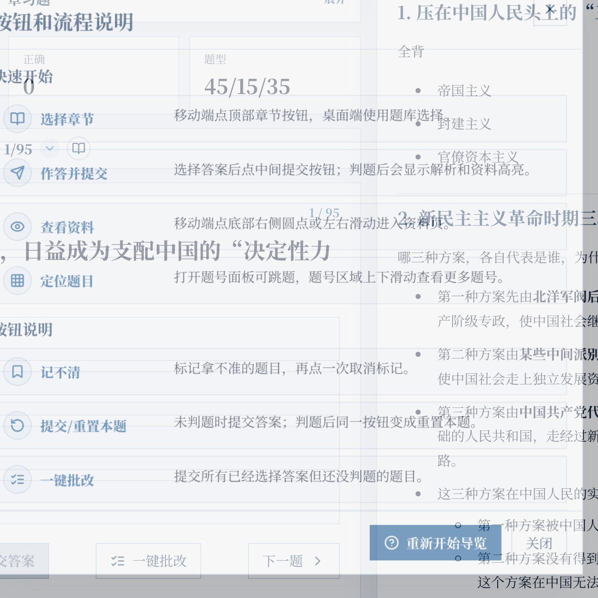

### 5. 支持资料开源

页脚的“支持资料开源”入口会打开捐赠弹窗。二维码按原比例显示，不会拉伸。

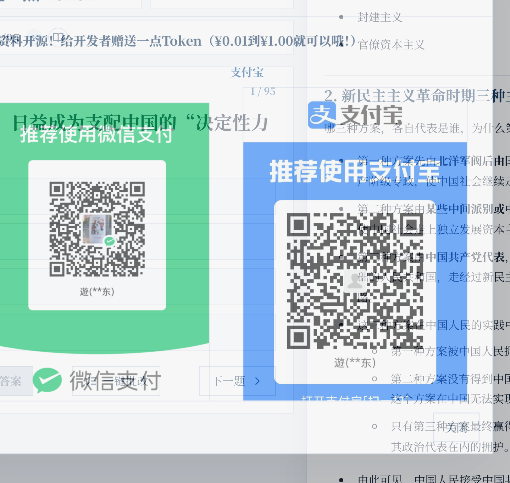

## 移动端

### 1. 顶部快捷入口

移动端顶部左侧是章节选择，右侧是题号面板。两个入口都以悬浮菜单展开，不会把答题区域向下挤开。

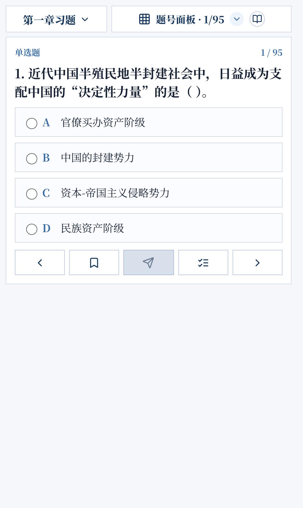

### 2. 题号面板

点击“题号面板”可查看题目状态、跳转题号，并使用“重置 / 全部 / 撤销”工具。题号区域可上下滚动，常驻按钮位于标题右侧。

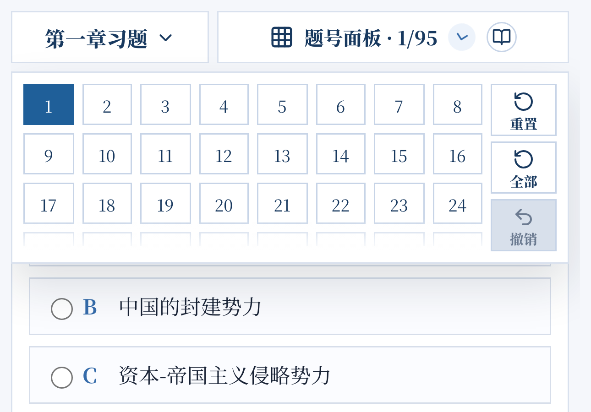

### 3. 查看本题知识点

移动端提交后会出现“查看本题知识点”按钮。点击后切换到资料页，并定位到当前题对应的高亮段落。

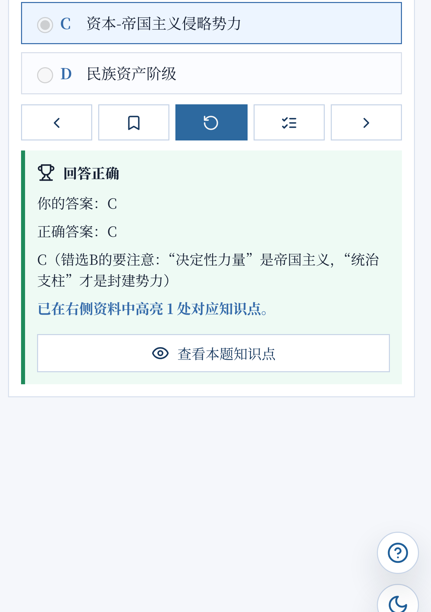

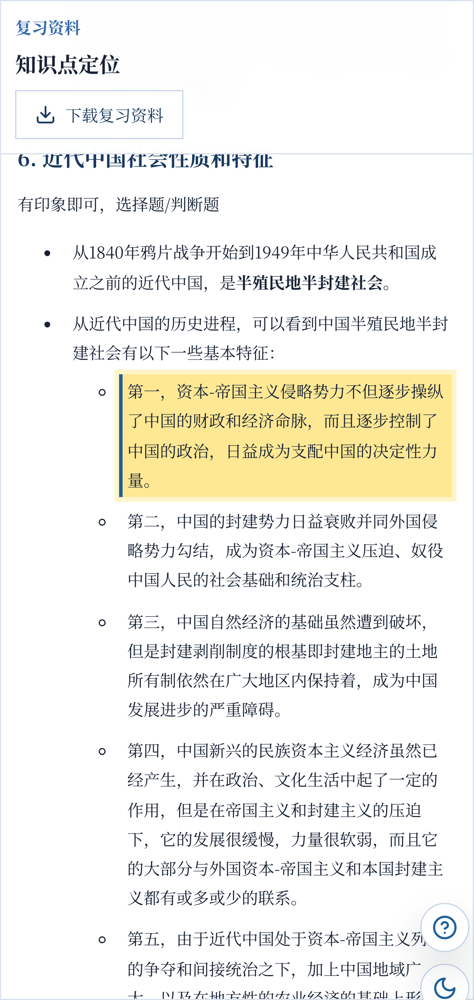

### 4. 夜间模式

右下角圆形按钮可以快速切换日间/夜间模式；完整主题设置也可以在章节菜单中调整。

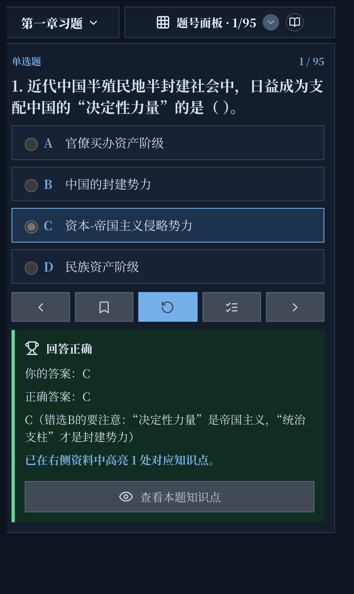

### 5. 帮助与章节菜单

移动端同样提供帮助面板和章节菜单。帮助面板可滚动查看按钮说明；章节菜单内包含章节切换、判题模式、主题和下载入口。

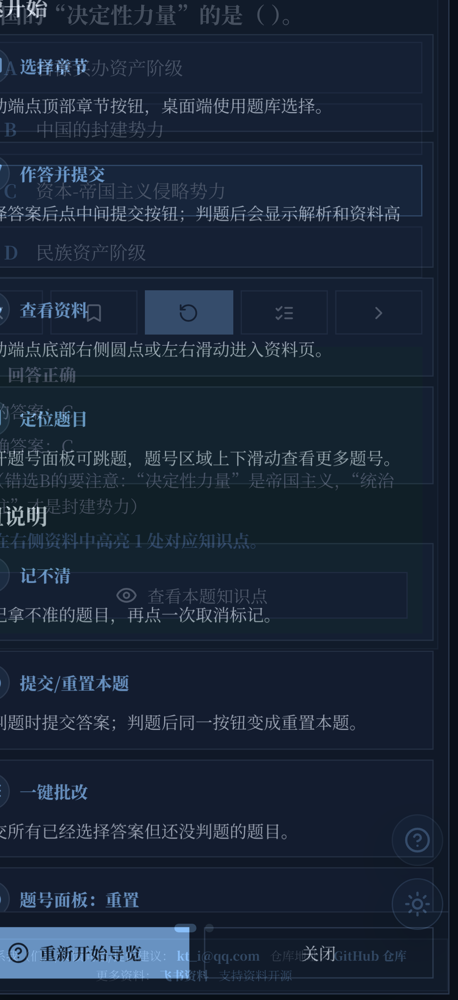

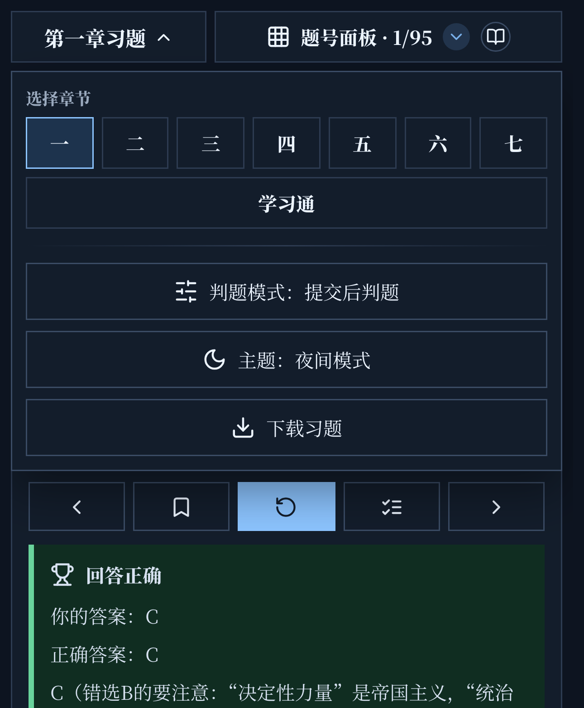
